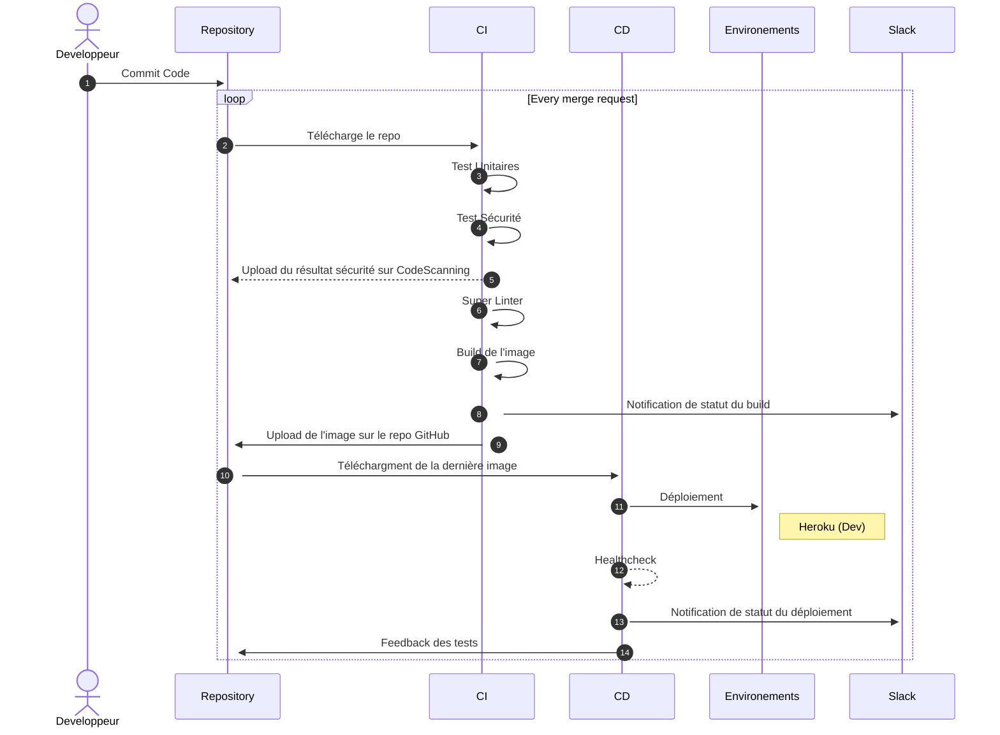

## 📍 Introduction

Nous avons reçu la mission de faire une pipeline CICD sur un projet Node.JS. 

Le code était sur GitHub donc nous avons décidé de faire une pipline 100% github.
Pour le bon déroulement du projet, nous avons décidé de protéger la brache main.

Deux conditions s'appliquent :
1. Nous avons besoin de faire un pull request avant de mergé sur la 'main'.
2. 2 personnes doivent review la pull request avant de pouvoir mergé sur la 'main'.

Cela assurer une qualité de code et de fonctionnement du projet.

Aussi, nous pouvons ajouter une condition sur les tests de la pipeline CI.
En effet, sur chaque pull request et sur chaque commit de cette pull request, la pipeline CI nous permets de vérifier le bon fonctionnement du projet.

Avec ces trois conditions, nous nous assurons un bon fonctionnement du projet avant de merger sur la main branche.
La branche main représente donc pour nous l'environnement  staging et prod.

Le concept de CICD ♾️ est respecté et permet un cycle de développement de l'application rapide et à haute intencité.


## GitHub Actions en Bref

Le fonctionnement de GitHub Actions:


## 🧮 Les fonctionnallités de la pipeline
Nous avons 3 pipelines, Dev, Staging puis Prod

### ⛹️‍♂️ La pipeline CI Dev, étape par étape

- On récupère le contenu de notre repository
- On installe Node.JS 
- On vérifie le contenu du cache
- On installe les dépendances
- On lance le serveur Node.JS
- On lance les tests unitaires
Puis si cela fonctionne on passe à la sécurité :
- On lance snyk vérifié s'il y a d'éventuelles vulnérabilités
- On upload le résultat sur CodeScanning, un service disponible sur GitHub directement dans notre repo.
S'il n'y a aucunes vulnérabilités, on passe à l'étape du Linter.
- On récupère le contenu du repository.
- On vérifie le repo avec super-linter qui vérifie la qualité du code.
Puis un passe à l'étape du build de l'image
- On build l'image avec BuildX
- On la push sur le package repository associé à notre répo github.
Puis pour finir, la dernière étape consiste à notifier du résultat sur slack.

Une fois les test finit, on regarde ensemble pour mérger la pull request.
Si la pull request est mergé, la pipepine staging s'enclenche.

### 🤾‍♂️ La pipeline CD Dev

- On récupère le package sur le repo github 
- On le deploy sur heroku
- On fait un healthcheck pour s'assurer du bon fonctionnement
- On envoie une notification sur Slack

### 🌠 La pipeline CI et CD Staging et Prod

- On test 
- On upload sur un EC2 AWS
- add monitoring


## 🔬 Installation pipeline

- Télécharger les fichiers ci.yml et cd.yml 
- Avoir un compte AWS et Heroku
- Faire deux EC2 avec le bon user-data.sh en exécution
- Assurez-vous d'avoir les bonnes variables d'environements


### Pipeline Prod


## 🖥️ Le stack du site web

**Client:** HTML, CSS

**Serveur:** Node, Express


## ♾️ Le stack de la pipeline

**Conteneurisation:** Docker

**Hébergement:** Heroku et AWS

**Sécurité:** Snik

**Linter:** Super Linter

**Registre de container:** GitHub Registry container

**WebHook:** Slack
## 🔀 Diagramme séquentielle de la branche Dev




## 🪛 Pour installer le projet en local

Vous pouvez installer le projet avec le gestionnaire de paquage npm.
Vous avez besoin d'un serveur Node.JS avec la version 14.16

```bash
  npm install bdx-groupe-1
  cd my-project
  npm run start
```

## 📝 Auteurs

- [@arnaudtron](https://www.github.com/arnaudtron)
- [@karim](https://www.github.com/styldown)
- [@gatienboquet](https://www.github.com/gatienboquet)
## 🔔 Badges

Add badges from somewhere like: [shields.io](https://shields.io/)

[](https://github.com/tterb/atomic-design-ui/blob/master/LICENSEs)
[](https://opensource.org/licenses/)
[](http://www.gnu.org/licenses/agpl-3.0)

## 🔐 Les variables d'environements 

Pour pouvoir assurer le fonctionnement de la pipeline CICD, vous avez besoin de définir certaines variables. 
Ces variables sont confidentielles, assurez-vous de ne pas les divulguer publiquement.

`HEROKU_API_KEY` : La clé API pour déployer sur Heroku

`SNYK_TOKEN` : La clé pour l'analyse du code avec Snyk

`TOKEN_REPO` : La clé pour l'upload et le téléchargement depuis le GitHub Packages

`SLACK_WEBHOOK_URL` : Le lien du webhook Slack pour les notifications

`AWS_PRIVATE_KEY` : La clé privé du serveur EC2 d'AWS

`HOSTNAME_PROD` : Le nom d'hote du serveur EC2 d'AWS pour la Prod

`HOST_NAME_STG` : Le nom d'hote du serveur EC2 d'AWS pour le staging

`USER_NAME`: L'username du serveur EC2 d'AWS
## 📚 Leçons apprises

Github Actions ne faisait pas partie du cursus de notre formation; nous avons pu découvrir les fonctionnalités que github proposent et approfondir nos connaissances de création de pipeline cicd dans une technologie nouvelle.

## 👏 Remerciements

 - [Ulrich MONJI](https://github.com/ulrichmonji)
 - [Git Workflow](https://medium.com/@patrickporto/4-branching-workflows-for-git-30d0aaee7bf)
 - [How to write a Good readme](https://bulldogjob.com/news/449-how-to-write-a-good-readme-for-your-github-project)


## 📜 License

[MIT](https://choosealicense.com/licenses/mit/)


## 💡 Améliorations possibles

- Rajouter une plus grosse étape sur le monitoring : AWS CloudWatch
- Avoir un linter plus rapide, comme MegaLinter
